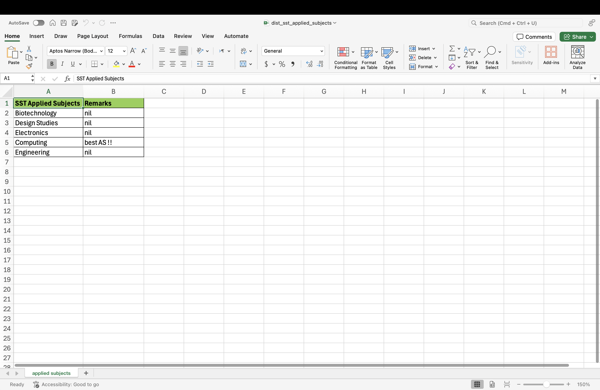
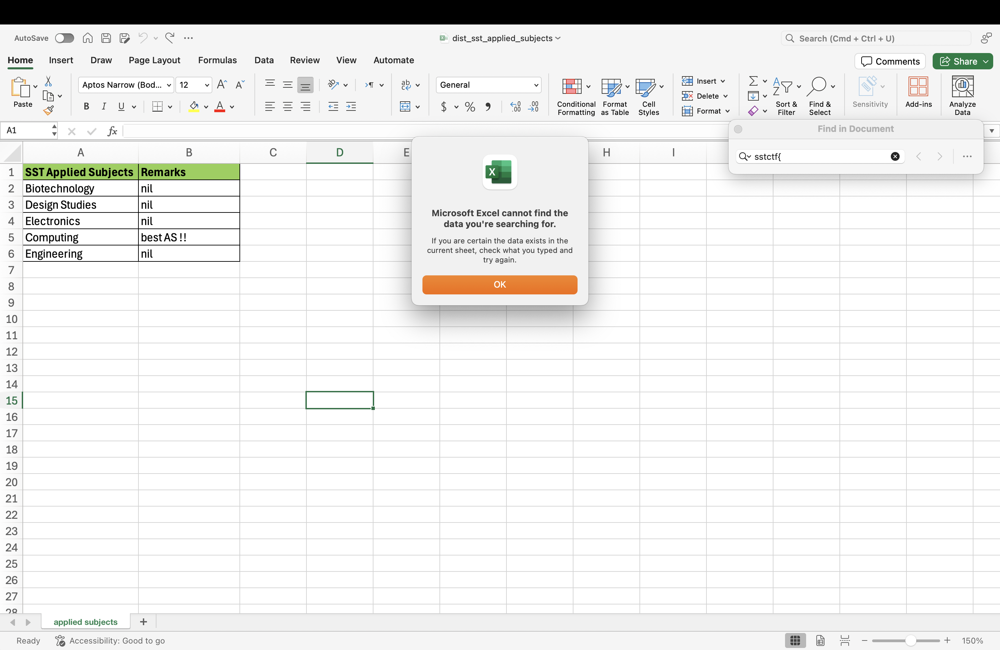
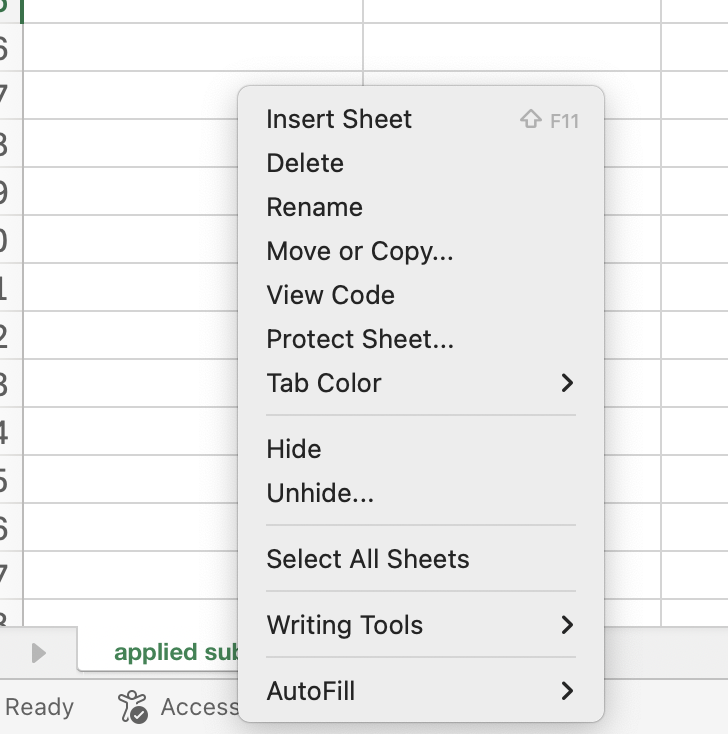
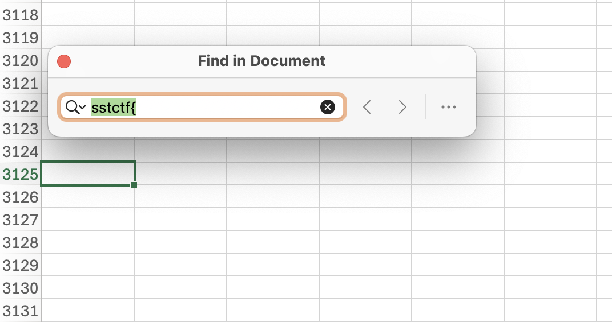

# An Innocent Spreadsheet

## Difficulty: Easy

We are given an **Excel Spreadsheet** named ```dist_sst_applied_subjects.xlsx```

The spreadsheet shown doesn't seem to contain anything.


In fact, ```command + f``` does not find anything in the spreadsheet.


I learnt from a simple google search that you could hide spreadsheets from view. As nothing can be found on this page itself, I deduced that there must be a hidden sheet that i currently cannot see.

Right clicking the sheets section shows an unhide button.


Clicking it shows that there is indeed a hidden file named: ```whats this 👀```


Unhiding it still doesn't show us anything. It's still a blank spreadsheet, so i suspect it's hidden in white.  

So, I do ```command + f``` and search for the flag starter (sstctf). It finds it at **column 3125**.


Flag found.  


Answer: **sstctf{3xc3l1n3xc3l}**